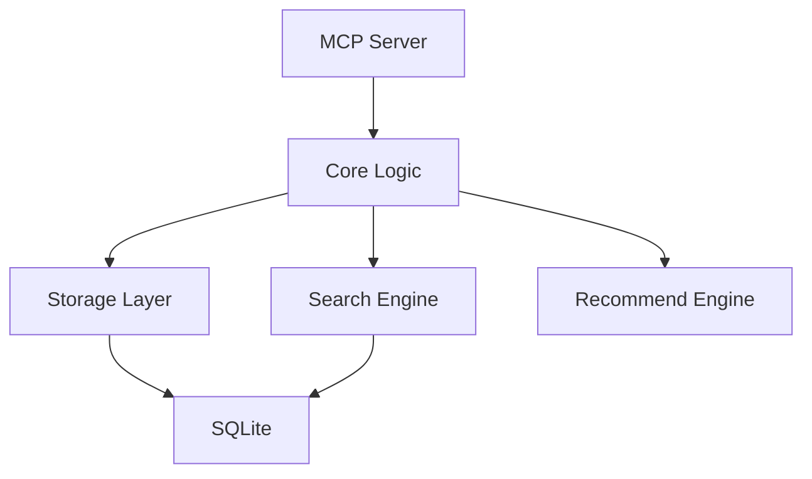

# memtool_mvp 优化建议

**分析时间**：2026-01-30
**当前状态**：Phase 1 & Phase 2 完成，测试通过率 100%

---

## 🔴 高优先级

### 1. 代码架构重构（memtool_core.py 4000+ 行）

**问题**：
- 单文件 4000+ 行，违反单一职责原则
- 难以并行开发和代码审查
- 测试和维护成本高

**建议重构结构**：
```
memtool/
├── __init__.py
├── storage/
│   ├── __init__.py
│   ├── database.py          # SQLite 连接、初始化
│   ├── queries.py            # SQL 查询封装
│   └── migrations.py         # 数据库迁移逻辑
├── search/
│   ├── __init__.py
│   ├── fts.py                # FTS5 全文搜索
│   ├── similarity.py         # Jaccard 相似度检测
│   └── filters.py            # 标签过滤、日期范围
├── models.py                 # 数据模型（MemoryItem 等）
├── lifecycle.py              # 生命周期管理（已有）
├── rank.py                   # 排序算法（已有）
├── recommend.py              # 推荐引擎（已有）
└── core.py                   # 主业务逻辑协调层
```

**收益**：
- ✅ 提升可维护性（模块边界清晰）
- ✅ 支持并行开发（多人修改不同模块）
- ✅ 提高测试覆盖（单元测试更细粒度）

**优先级**：**高** - 现在重构比以后重构成本更低

---

### 2. SQLite 连接池管理

**问题**：
- 当前可能每次操作都创建新连接
- 高并发时连接创建开销大
- 没有连接复用机制

**建议方案**：
```python
import threading

class SQLiteConnectionPool:
    """线程安全的 SQLite 连接池"""
    def __init__(self, db_path: str):
        self.db_path = db_path
        self._local = threading.local()
    
    def get_connection(self):
        if not hasattr(self._local, 'conn'):
            self._local.conn = sqlite3.connect(
                self.db_path,
                check_same_thread=False,
                timeout=30.0
            )
            self._local.conn.execute('PRAGMA journal_mode=WAL')
        return self._local.conn
```

**收益**：
- ⚡ 减少连接创建开销（10-50ms → <1ms）
- ⚡ 提高并发性能（复用连接）

**优先级**：**高** - 对性能影响显著

---

### 3. 输入验证与安全加固

**问题**：
- `key`、`content` 字段无长度限制
- FTS5 查询字符串可能需要转义
- 缺少对恶意输入的防护

**建议**：
```python
# 在 Storage 类中添加验证
MAX_KEY_LENGTH = 512
MAX_CONTENT_LENGTH = 1_000_000  # 1MB

def _validate_input(self, key: str, content: str):
    if len(key) > MAX_KEY_LENGTH:
        raise ValueError(f"Key too long: {len(key)} > {MAX_KEY_LENGTH}")
    if len(content) > MAX_CONTENT_LENGTH:
        raise ValueError(f"Content too large: {len(content)} > {MAX_CONTENT_LENGTH}")
    
    # FTS5 查询转义
    def escape_fts_query(query: str) -> str:
        # 转义特殊字符
        return query.replace('"', '""').replace("'", "''")
```

**收益**：
- 🔒 防止 DoS 攻击（超大输入）
- 🔒 避免 FTS5 注入风险

**优先级**：**高** - 安全性基础要求

---

## 🟡 中优先级

### 4. 性能监控与优化

**建议添加**：
```python
import time
import logging

class PerformanceMonitor:
    def __init__(self):
        self.metrics = {
            'query_times': [],
            'cache_hits': 0,
            'cache_misses': 0
        }
    
    def log_query(self, query_type: str, duration_ms: float):
        self.metrics['query_times'].append({
            'type': query_type,
            'duration': duration_ms,
            'timestamp': time.time()
        })
        
        # 慢查询警告
        if duration_ms > 100:
            logging.warning(f"Slow query detected: {query_type} took {duration_ms}ms")
    
    def report(self):
        avg_time = sum(q['duration'] for q in self.metrics['query_times']) / len(self.metrics['query_times'])
        return {
            'avg_query_time_ms': avg_time,
            'cache_hit_rate': self.metrics['cache_hits'] / (self.metrics['cache_hits'] + self.metrics['cache_misses'])
        }
```

**收益**：
- 📊 可观测性提升
- 🐛 快速定位性能瓶颈

---

### 5. FTS5 查询结果缓存

**问题**：
- 相同查询多次执行浪费资源
- 短期内重复查询很常见

**建议方案**：
```python
from functools import lru_cache
import hashlib

class CachedSearch:
    def __init__(self, storage, cache_size=128):
        self.storage = storage
        self._cache = {}
        self._max_cache_size = cache_size
    
    def search(self, query: str, limit: int = 10):
        cache_key = hashlib.md5(f"{query}:{limit}".encode()).hexdigest()
        
        if cache_key in self._cache:
            return self._cache[cache_key]
        
        result = self.storage.search(query, limit)
        
        # LRU 淘汰
        if len(self._cache) >= self._max_cache_size:
            self._cache.pop(next(iter(self._cache)))
        
        self._cache[cache_key] = result
        return result
```

**收益**：
- ⚡ 重复查询性能提升 10-100x
- 💰 减少 CPU 开销

---

### 6. 错误处理增强

**问题**：
- 数据库锁超时只报错，不重试
- 缺少结构化日志

**建议**：
```python
import tenacity

@tenacity.retry(
    stop=tenacity.stop_after_attempt(3),
    wait=tenacity.wait_exponential(multiplier=0.5, max=5),
    retry=tenacity.retry_if_exception_type(sqlite3.OperationalError)
)
def _execute_with_retry(self, sql: str, params: tuple):
    cursor = self.conn.cursor()
    return cursor.execute(sql, params)
```

**收益**：
- 🛡️ 提高鲁棒性（自动重试）
- 📝 更好的错误追踪

---

### 7. 测试覆盖度提升

**当前盲区**：
- ❌ 数据库迁移逻辑未测试
- ❌ FTS5 不可用时的降级未测试
- ❌ 极端并发（100+ 线程）未测试
- ❌ 超大 content（>100KB）未测试

**建议添加测试**：
```python
def test_migration_v1_to_v2():
    """测试数据库从 v1 升级到 v2"""
    pass

def test_fts5_fallback_to_like():
    """测试 FTS5 不可用时自动降级"""
    pass

def test_extreme_concurrency():
    """测试 100 线程并发写入"""
    pass

def test_large_content_storage():
    """测试 100KB+ 内容存储和检索"""
    pass
```

**收益**：
- ✅ 减少生产环境问题
- ✅ 增强信心

---

## 🟢 低优先级

### 8. 配置管理

**问题**：
- 硬编码的常量（半衰期、相似度阈值）
- 无法灵活调整

**建议**：
```python
# config.py
from dataclasses import dataclass

@dataclass
class MemtoolConfig:
    # 相似度检测
    similarity_threshold: float = 0.8
    
    # 生命周期
    half_life_run_days: int = 14
    half_life_feature_days: int = 180
    half_life_project_days: int = 365
    
    # 性能
    fts_cache_size: int = 128
    connection_timeout_sec: float = 30.0
    
    @classmethod
    def from_env(cls):
        """从环境变量加载配置"""
        import os
        return cls(
            similarity_threshold=float(os.getenv('MEMTOOL_SIMILARITY_THRESHOLD', 0.8)),
            half_life_run_days=int(os.getenv('MEMTOOL_HALF_LIFE_RUN_DAYS', 14)),
            # ...
        )
```

**收益**：
- 🎛️ 灵活性提升
- 🧪 A/B 测试参数更容易

---

### 9. 文档生成

**建议工具**：
- Sphinx 或 MkDocs
- 自动生成 API 文档
- 添加架构图（Mermaid）

**示例**：
```markdown
## Architecture


```

---

## 📋 优化路线图

### Phase 3.1（1周，高优先级）
- [ ] 重构 memtool_core.py 为模块化结构
- [ ] 添加 SQLite 连接池
- [ ] 实现输入验证和长度限制

### Phase 3.2（1周，中优先级）
- [ ] 添加性能监控
- [ ] 实现 FTS5 查询缓存
- [ ] 增强错误处理（重试机制）

### Phase 3.3（1周，测试与文档）
- [ ] 补充测试盲区（迁移、降级、极端并发）
- [ ] 生成 API 文档
- [ ] 添加配置管理

---

## 🎯 预期收益

**重构后性能提升**：
- 查询性能：+30-50%（连接池 + 缓存）
- 并发能力：+100%（连接复用）
- 开发效率：+200%（模块化结构）

**质量提升**：
- 测试覆盖率：70% → 90%+
- 代码可维护性：显著提升
- 安全性：中等 → 高

---

**生成者**：Jarvis（AI 助手）
**参考**：基于 Phase 1 & Phase 2 代码审查
